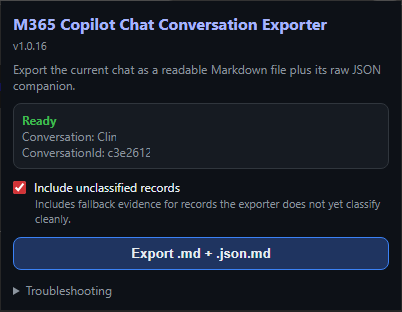

# M365 Copilot Chat Conversation Exporter — Browser Extension

Version: **v1.0.27**

Export Microsoft 365 Copilot Chat conversations as readable Markdown with a raw JSON companion.

## What it does

This Manifest V3 browser extension exports the current Microsoft 365 Copilot Chat conversation from an authenticated browser session.

The extension is intended for Edge/Chromium-compatible browsers and currently focuses on local validation and export behaviour.

## Screenshot



## Output files

The extension can generate:

1. readable Markdown (`.md`) for human review and handoff;
2. raw JSON Markdown (`.json.md`) as the complete local backup;
3. diagnostic JSON Markdown (`.diagnostic.json.md`) when troubleshooting is needed.

## Load locally

Load the extension runtime folder as an unpacked extension:

```text
app
```

After reloading the extension, refresh the Microsoft 365 Copilot Chat tab so the latest content scripts are active.

## Usage

1. Open a Microsoft 365 Copilot Chat conversation.
2. Open the extension popup from the browser toolbar.
3. Confirm the popup shows the expected conversation title and conversation ID.
4. Click the export button.
5. Keep the generated Markdown and raw JSON Markdown files together.

## Current behaviour

- Shows the active conversation title and conversation ID in the popup.
- Exports readable Markdown plus a raw JSON Markdown companion.
- Uses filesystem-safe timestamped filenames.
- Keeps troubleshooting and diagnostic controls available but secondary.
- Includes an option to include unclassified records for deeper troubleshooting.

## Permissions

The extension requests browser permissions needed to read the active Microsoft 365 Copilot Chat page and trigger local downloads. Host permissions are scoped to Microsoft 365 Copilot and related Microsoft 365/Substrate endpoints used by the exporter.

## Source and support

Source:

```text
https://github.com/site-speed/M365-Copilot-Chat-Export-extension
```

Issues:

```text
https://github.com/site-speed/M365-Copilot-Chat-Export-extension/issues
```

## Privacy and data handling

Exports are produced from the authenticated browser session and may contain sensitive organisation data, prompts, responses, citations, file names, and tool traces.

Treat `.md`, `.json.md`, and `.diagnostic.json.md` files as private unless reviewed and deliberately shared.

## Limitations

- Microsoft 365 Copilot Chat APIs and page structure can change.
- The extension is not yet a store-published package.
- Diagnostic exports are intended for troubleshooting and may contain additional technical detail.

## Release notes

Current release notes are available at:

```text
assets/release-notes.md
```

## Security

See `SECURITY.md` for supported-version and reporting guidance.

## Licence

MIT License. Copyright 2026 Tim Moss.
